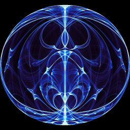

# dysy

This is a Rust-based application that generates various types of attractors in dynamic systems. The application features an interactive Egui-based GUI that allows users to modify initial values, parameters, iteration counts, and colors. The generated images can be saved in PNG format.

## Features

- Interactive Egui-based GUI for modifying initial values, parameters, iteration counts, and colors
- Allows you to set the attractor color for image generation
- Ability to save generated images in PNG format

The application supports the following types of attractor systems:

- Clifford
- Quadratic
- Symmetric
- Trigonometric
- Polar
- Lorenz
- Duffing
- DoublePendulum

## Example Images

Here are some examples of attractors generated by the application:

 

 

 

## Installation and Usage

To run the application, you&#x27;ll need to have Rust installed on your system. You can then clone the repository and build the project using the following commands:

```
git clone https://github.com/taka8t/dysy.git
cargo run --release
```

This will launch the Egui-based GUI, where you can interact with the application and generate attractors.

## Future Plans

- ~~save parameter and load parameter (serialize / deseriarize)~~
- Implement the ability to load a custom dynamic system from a configuration file
- Add examples of dynamic systems (Double pendulum etc...)
- Image generation feature that represents characteristics other than trajectories
- Various analyses and simulations of dynamic systems
- 3D projection feature
